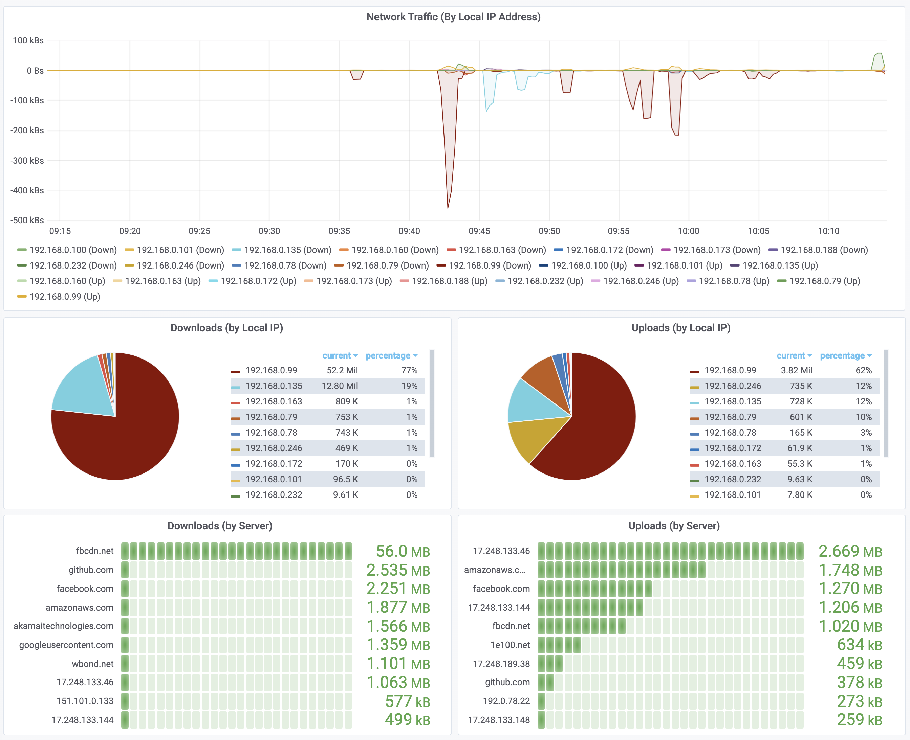

# Network Traffic Metrics
---
See all the inbound and outbound traffic for your network, broken down by server and client.

Network traffic (`bytes` and `packets`) are exported to **Prometheus**, labeled with `src`, `dst`, `service`, and `proto`.

Comes with a pre-built **Grafana** dashboard:



## Documentation/Help
---

Read the [website](https://www.technicallywizardry.com/traffic-monitoring-software-grafana) for more help.

## Requirements
---

The device which runs this code must have a network interface across which the traffic flows. For monitoring traffic between the internal network and the internet, this usually means a bridged network interface. For example, a Raspberry Pi that bridges the LAN (`eth0`) traffic to the WAN (`eth1`). See the [documentation](https://www.technicallywizardry.com/traffic-monitoring-software-grafana) for more help setting this up. That said, this will work for any network interface you wish to monitor.

## Installation
---

### Locally

_Python >= 3.7 is required._

* `git clone https://github.com/zaneclaes/network-traffic-metrics.git`
* `pip install argparse prometheus_client`

Then run `network-traffic-metrics.py` using the arguments described in the Configuration section, below.

**Example**: monitor in/out traffic for the `192.168.0.0/24` subnet:

`python3 network-traffic-metrics.py "src net 192.168.0.0/24 or dst net 192.168.0.0/24"`

Then open your internet browser to `http://localhost:8000/metrics` to see the Prometheus endpoint.

### Docker

_**Note**: the container must run on the host network if you want to monitor the LAN traffic as oppposed to the traffic between containers. This should be done with caution, as it may create a security vulnerability._

There are two Docker images provided:

* `inzania/network-traffic-metrics:latest`
* `inzania/network-traffic-metrics:arm`

Choose the latter if running on a Raspberry Pi.

### Docker-compose

There is a `docker-compose.yml` file that integrates network-traffic-metrics with Pormetheus and Grafana in a single file. Before running it, change the following parameters:
* image monitor. By default `inzania/network-traffic-metrics:latest`, you can change to `inzania/network-traffic-metrics:arm` on ARM devices (for example Raspberry pi)
* `NTM_INTERFACE` variable must contain the name of the network interface that you want to monitor
* `NTM_FILTERS` variable must contain the filter you want to apply.
* `"monitor:192.168.1.110"` must contain the ip of `NTM_INTERFACE`

Once you have changed those variables, you can run the whole stack running:
> sudo docker-compose up

### Kubernetes

A sample Kubernetes deployment can be found at `kubernetes.yaml`.

## Configuration
---

You should, at a minimum, provide the positional `filters` argument to limit the packets which are captured to those which you are interested in. These `filters` are passed directly to `tcpdump` ([man](https://www.tcpdump.org/manpages/tcpdump.1.html)).

Running the script with the `--help` flag gives:

```
usage: network-traffic-metrics.py [-h] [--interface INTERFACE] [--port PORT]
                                  [--metric_prefix METRIC_PREFIX] [--fqdn]
                                  [filters]

positional arguments:
  filters               The TCPdump filters, e.g., "src net 192.168.1.1/24"

optional arguments:
  -h, --help            show this help message and exit
  --interface INTERFACE, -i INTERFACE
                        The network interface to monitor.
  --port PORT, -p PORT  The Prometheus metrics port.
  --metric_prefix METRIC_PREFIX, -s METRIC_PREFIX
                        Metric prefix (group) for Prometheus
  --fqdn, -f            Include the FQDN (will increase cardinality of metrics
                        significantly)
```

Each one of these may also be configured as an environment variable: `NTM_FILTERS`, `NTM_INTERFACE`, `NTM_PORT`, `NTM_METRIC_PREFIX` (useful when using Docker/Kubernetes).

### Prometheus

Just point the Prometheus server to the metrics endpoint (i.e., `http://192.168.0.1:8000/metrics`)

### Grafana

* Make sure that you have connected Prometeheus as a "Data Source" in Grafana.
* Follow the [Grafana import instructions](https://grafana.com/docs/grafana/latest/reference/export_import/#importing-a-dashboard) to import the [GrafanaLabs dashboard](https://grafana.com/grafana/dashboards/12619). You should be able to follow either import approach (download the JSON, or use GUID `12619`).

## How it works
---

* Packets are captured via `tcpdump`
* Two counters are created: `ntm_packets` and `ntm_bytes`
* Each metric has the labels: `src`, `dst`, `proto`, and `service`
* When `tcpdump` does not explicitly state the `service`, it is determined by using the `proto` and `port` from the packet to look up the service name via `/etc/services`.

